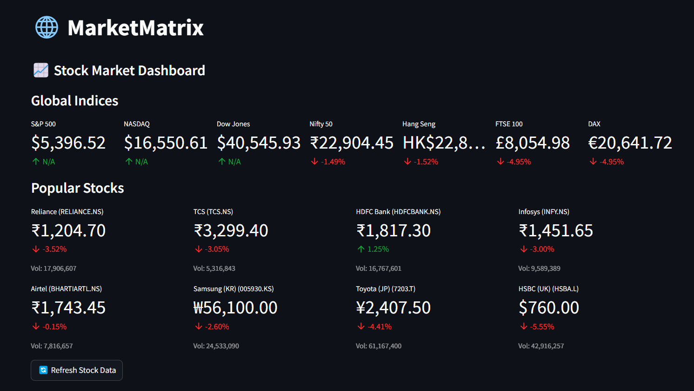
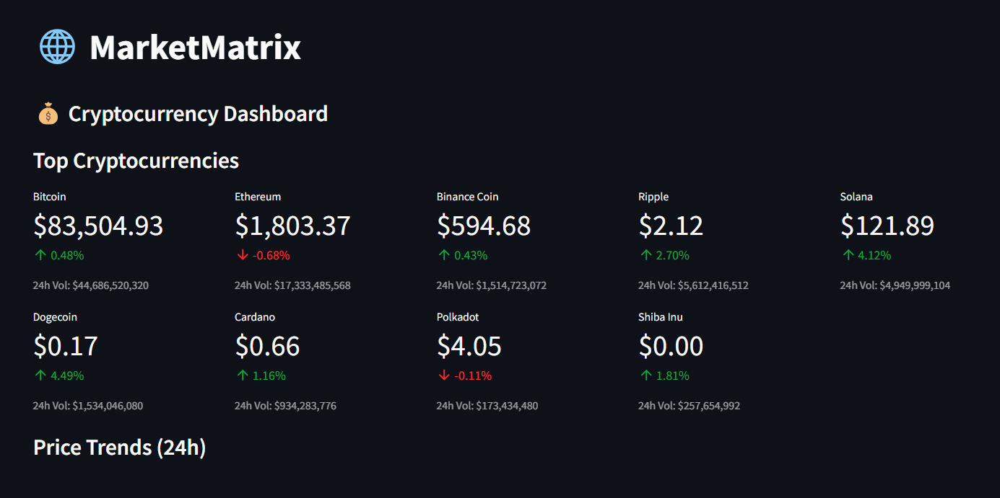
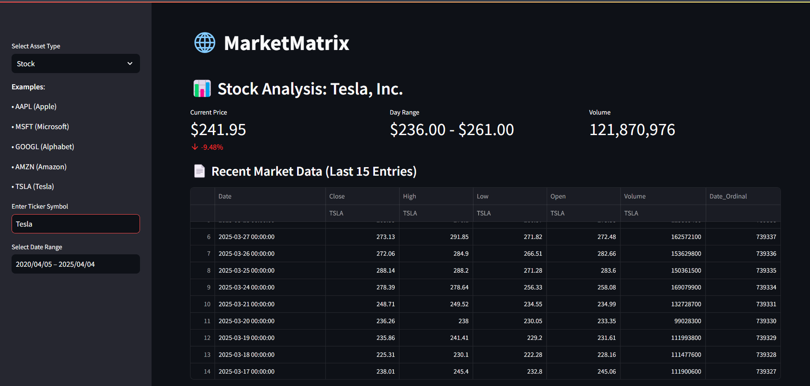
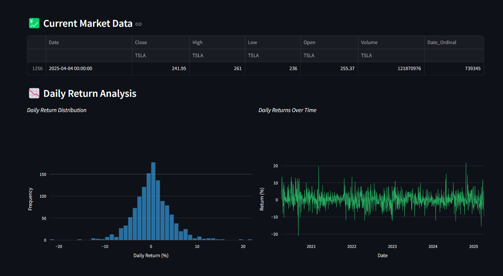
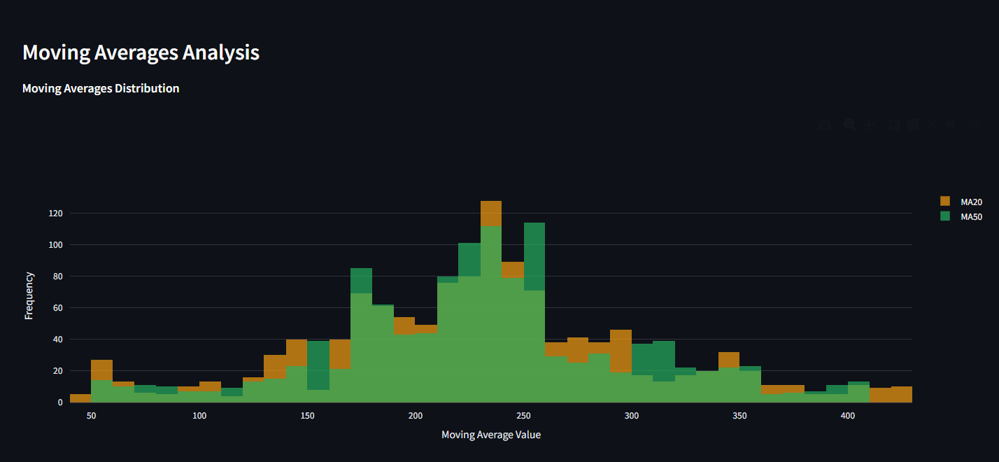
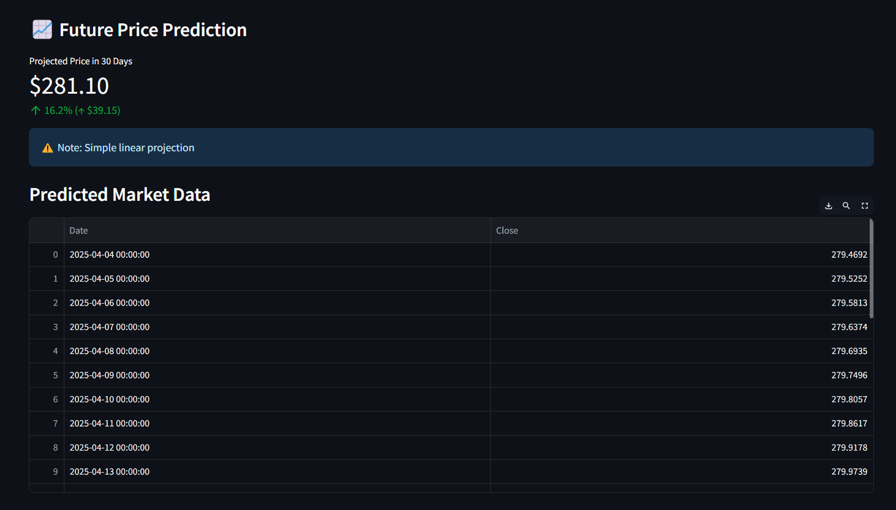
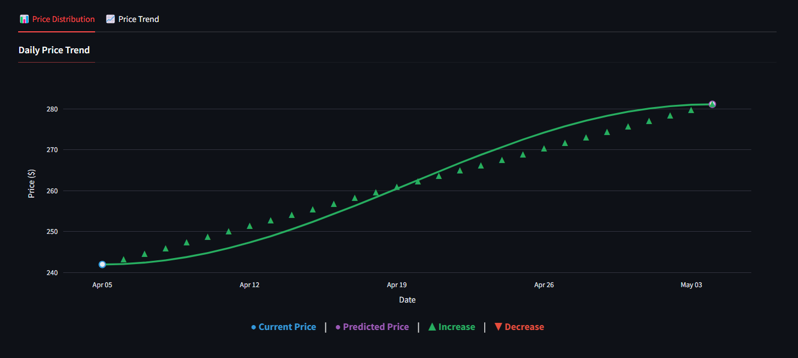

# 🌐 MarketMatrix - Financial Asset Analysis Dashboard


**MarketMatrix** is an interactive financial dashboard that provides comprehensive analysis of **stocks** and **cryptocurrencies** with real-time data, predictive modeling, and dynamic visualization tools.

---

## 📌 Features

-  **Multi-Asset Support**: Analyze both stocks and cryptocurrencies
-  **Real-Time Market Data**: Global coverage including US, India, and international assets
-  **Interactive Visualizations**: Zoomable & hover-enabled charts using Plotly
-  **Technical Indicators**: Includes moving averages, returns, and trends
-  **Forecasting**: 30-day price prediction using linear regression
-  **Download Support**: Export data tables for offline analysis
-  **Responsive UI**: Smooth experience across desktop and mobile

---

## 📊 Supported Assets

###  Stocks:
- **US**: `AAPL`, `MSFT`, `TSLA`
- **India**: `RELIANCE.NS`, `TCS.NS`, `INFY.NS`
- **International**: `005930.KS` (Samsung), `7203.T` (Toyota)

###  Cryptocurrencies:
- `BTC-USD` (Bitcoin), `ETH-USD` (Ethereum), `SOL-USD` (Solana)

---

## 🛠️ Installation

1. **Clone the repository**:
   ```bash
   git clone https://github.com/swap1930/StockMarket.git
   cd marketmatrix
   ```

2. **Install dependencies**:
   ```bash
   pip install -r requirements.txt
   ```

3. **Run the Streamlit app**:
   ```bash
   streamlit run app.py
   ```

---

## ▶️ Usage

1. Select asset type (Stock or Crypto) from the sidebar  
2. Enter the ticker symbol manually or choose a suggested one  
3. Set your desired date range for analysis  
4. Navigate through dashboard tabs:

   - **Market Overview**: See current market prices and stats  
   - **Technical Analysis**: Visualize moving averages and returns  
   - **Price Prediction**: View 30-day forecasted price trends  

---

## ⚙️ Tech Stack

- **Frontend**: Streamlit  
- **Data Source**: `yfinance` API  
- **Visualization**: Plotly  
- **Machine Learning**: `scikit-learn` (Linear Regression)  
- **Performance Optimization**: `st.cache_data`  

---

## 🚀 Future Enhancements

- Add more technical indicators (e.g., RSI, MACD)  
- Include portfolio tracking functionality  
- Integrate sentiment analysis from news/social media  
- Add alert/notification system for price changes  
- Implement dark/light mode toggle  

---

## 📸 Screenshots

<div style="display: flex; justify-content: center; gap: 20px;">
  
  
</div>
<br>
<div style="display: flex; justify-content: center; gap: 20px;">
  
  
</div>
<br>
<div style="display: flex; justify-content: center; gap: 20px;">
  
  
</div><br>
<div style="display: flex; justify-content: center; gap: 20px;">

</div>

---

## 👨‍💻 Author

**Swapnil Dudhane**  
📍 GPKP | SYIT Student | Aspiring Data Scientist 

📧 Email: swapnildudhane1930@gmail.com 
💼 LinkedIn: www.linkedin.com/in/swapnil1930 <br>
💻 GitHub: https://github.com/swap1930

---

